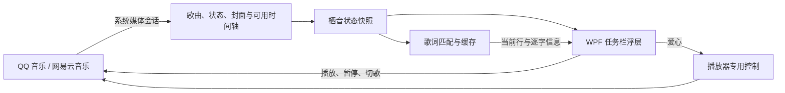

# 栖音 Qiyin

**让音乐栖在任务栏上。**

栖音是一款适用于 Windows 11 的轻量任务栏音乐控制组件。它把封面、歌曲、播放按钮和爱心放在任务栏附近，方便在工作时控制 QQ 音乐和网易云音乐。

名称中的“栖”代表安静停留，“音”代表音乐。图标将音符与停栖的小鸟结合，延续 A1 界面的深绿色调。

[下载安装包](https://github.com/kuong1127/qiyin/releases/latest) · [查看版本](https://github.com/kuong1127/qiyin/releases)

本仓库提供**使用文档、图标、实际运行图片和安装包发布**，当前不包含应用源码。

## 实际运行图片

下列图片来自 Windows 上运行的栖音组件，仅截取播控区域。

播放中：显示双竖线，点击暂停。

已暂停：显示三角形，点击继续播放。

图标为 AI 辅助设计素材；上面的播控图片为真实程序截图，不是生成的界面示意图。

## 下载与安装

1. 打开 [Releases](https://github.com/kuong1127/qiyin/releases/latest)，下载 `Qiyin-Setup-0.2.9-win-x64.exe`。
2. 双击安装。可选择桌面快捷方式和登录 Windows 后自动启动。
3. 完成后启动栖音，打开 QQ 音乐或网易云音乐，播放一首歌曲。
4. 如果没有显示歌曲，按下文检查播放器设置。

支持环境为 **Windows 11、Intel / AMD 64 位电脑**。安装包包含 .NET 8 运行环境，安装时不需要另外下载 .NET；歌曲封面与歌词查询需要网络。

安装只影响当前 Windows 用户。程序已有实例时，新实例会退出；更新后若仍看到旧版本，请先从旧组件的右键菜单退出，再启动新版本。默认安装路径为 `%LOCALAPPDATA%\Programs\TaskbarMediaBar`。

安装包未配置代码签名。发布页面提供 SHA-256 文件校验值；校验值用于确认文件完整性，不等同于代码签名。

## 播放器首次设置

### QQ 音乐

在 **设置 → 常规设置 → 通知** 中开启“系统媒体传输控件（SMTC）”。不同版本的设置名称可能略有变化。

### 网易云音乐

在 **设置 → 系统** 中勾选“开启 SMTC”，让栖音读取真实的播放 / 暂停状态。

爱心通过网易云的全局快捷键工作：在 **设置 → 快捷键** 中开启全局快捷键，并将“喜欢音乐”设为 `Ctrl+Alt+L`。如果你使用其他组合，可通过栖音右键菜单打开配置文件，修改相应的 `Like` 值。

没有 SMTC 会话时，栖音可以通过窗口标题显示歌名 / 艺人，并使用已配置的全局快捷键控制播放，但此时无法确认播放状态。默认后备播放快捷键为 `Ctrl+Alt+P`，上一首 / 下一首为 `Ctrl+Alt+← / →`。

## 功能范围

| 功能 | QQ 音乐 | 网易云音乐 |
| --- | --- | --- |
| 歌名、艺人和封面 | 支持 | 支持；后备封面可能需要联网匹配 |
| 上一首、下一首、播放 / 暂停 | 支持 | 支持，推荐开启 SMTC |
| 播放 / 暂停图标自动切换 | 有系统播放状态时支持 | 开启 SMTC 后支持 |
| 爱心加入 / 取消喜欢 | 支持，通过原生播放条操作 | 支持，通过全局快捷键操作 |
| 爱心状态确认 | 尽量回读原生按钮状态 | 窗口隐藏时可能暂时无法确认 |
| 同步歌词 | 有匹配歌词和有效进度时支持 | 当前原生接口下不提供 |
| 点击 / 拖动进度 | 支持兼容版本，实际能力受播放器限制 | 当前原生接口下不提供 |

网易云 3.1.40 的本机实测中，原生 SMTC 提供了歌曲与播放状态，**没有提供有效时间轴**。因此本版不会用猜测的进度滚动歌词，也不包含第三方网易云歌词扩展。其他播放器版本的行为可能不同。

## 常用操作

| 操作 | 作用 |
| --- | --- |
| 点击上一首 / 下一首 | 切换曲目 |
| 点击中间图标 | 播放或暂停；双竖线代表正在播放，三角形代表暂停 |
| 点击爱心 | 加入或取消“我喜欢”；未确认时可能显示待同步状态 |
| 点击封面 | 打开当前播放器窗口 |
| 拖动歌名或艺人文字区域 | 移动组件位置，并自动记忆 |
| 点击 / 拖动底部进度条 | 在播放器支持时跳转播放进度 |
| 右键组件或托盘图标 | 调整显示、封面、爱心、歌词、自启或退出 |
| 双击托盘图标 | 快速显示 / 隐藏组件 |

A1 界面保留四个简洁按钮，按钮悬停不弹出中文提示。没有媒体会话时，组件可以自动隐藏，托盘入口仍可使用。

## 实现原理

### 1. 从播放器获取信息

栖音使用 C#、.NET 8 和 WPF 绘制界面，通过 Windows 的 **Global System Media Transport Controls（GSMTC）** 读取播放器发布的媒体会话，包括歌曲、艺人、封面、播放状态和可用的时间轴。

组件监听歌曲、播放状态和时间轴事件，并结合周期刷新更新画面。多播放器同时存在时，综合配置的偏好与播放状态选择跟随的来源。没有媒体会话时，指定播放器可退回窗口标题读取。

### 2. 任务栏上的显示方式

界面采用位于任务栏上方的顶层小窗口，尽量避免点击操作抢走当前工作的焦点。控制器负责跟踪任务栏和显示器位置、缩放比例、托盘入口以及需要避让的常驻窗口。它没有替换 Windows 任务栏。

### 3. 播放控制和爱心为什么分开处理

播放、暂停和切歌优先使用 Windows 媒体会话命令；在后备通道中使用播放器已配置的全局快捷键。

Windows 的通用媒体会话没有跨播放器统一的“加入我喜欢”功能，因此爱心需要分别适配：

- **QQ 音乐：**通过辅助功能接口定位原生播放条及爱心，按点击时的实际布局发送后台鼠标消息，并回读状态。定位限制在播放条区域，避免误点歌单中的其他按钮。
- **网易云音乐：**发送用户配置的“喜欢音乐”全局快捷键。原生窗口已可见时可读取播放条图标，窗口隐藏时保留已知状态或待确认状态；状态检查不会为了读取图标主动拉起窗口。

异步操作会绑定当时的曲目身份，并限制重复提交，避免切歌后把旧结果写到新歌曲上。图标的即时反馈与播放器实际确认是不同阶段，未确认时不能把红心显示当作最终收藏凭证。

### 4. 歌词如何跟随进度

组件根据来源、歌名、艺人和时长匹配在线歌词，优先使用当前平台的搜索与歌词接口，并在可用时尝试其他歌词来源。匹配成功后缓存结果，减少重复请求。

有逐字时间信息时逐字高亮，否则按歌词行显示。显示时刻以播放器的真实时间采样为基准，在两次采样之间按播放状态和速率平滑推进；暂停时停止推进，收到新采样或跳转结果后重新对齐。

没有有效进度、没有匹配歌词或遇到纯音乐时显示艺人信息。歌词获取失败不会阻塞播放按钮，短暂失败会有限制地重试。

### 5. 进度跳转与确认

进度条把点击位置换算为目标播放秒数。对于支持系统跳转的会话，发送系统进度命令；QQ 音乐的兼容路径会定位原生进度条，校验时长和布局后发送点击，再等待播放器回传新进度。

发送命令不等于跳转成功。曲目变化、窗口布局无法确认或播放器超时时，组件会停止后续操作并提示结果；某些 QQ 兼容路径需要临时恢复原生窗口以定位进度条。

## 网络与本地数据

常规使用不要求向栖音提供 QQ / 网易云账号密码，也不需要复制登录 Cookie。收藏操作依赖播放器自身已有的登录状态。

为了查询封面和歌词，程序会把**歌名、艺人或歌曲标识**发送给对应的音乐服务。当前代码涉及 `music.163.com`、`y.qq.com`、`c.y.qq.com` 和 `u.y.qq.com` 等接口，以及服务返回的图片地址；接口是否可用由相应平台决定。

配置、歌词缓存和运行日志默认位于 `%APPDATA%\TaskbarMediaBar`。为兼容旧版，产品改名后保留该目录名。日志可能包含正在播放的歌曲、窗口状态、错误及诊断路径；分享日志前应检查这些信息。正常运行的网易云图标识别只在内存中处理图像，不主动保存桌面截图。

当前没有内置账号体系或自动上传诊断日志的功能。本仓库的发布内容不包括开发者个人配置、登录信息或完整运行日志。

## 常见问题

**安装后没有看到播控？** 先启动播放器并播放歌曲，再检查 SMTC。还可以从托盘图标恢复显示，或检查是否有旧组件仍在运行。

**网易云一直显示三角形？** 先确认“开启 SMTC”已勾选。仅通过窗口标题读取时，组件不能确认播放 / 暂停状态。

**网易云为什么不显示同步歌词？** 当前实测版本没有提供真实进度。本版明确保留这一限制，没有伪造歌词时间轴。

**爱心没有同步，或收藏失败？** 确认播放器已登录且歌曲允许收藏。网易云还需检查全局快捷键与 `Ctrl+Alt+L`。隐藏窗口可能无法即时回读状态，应以播放器“我喜欢”的实际结果为准。

**QQ 歌词或进度不正常？** 检查歌曲是否有歌词、网络是否可用以及播放器是否提供有效进度。播放器升级或界面布局变化也可能影响兼容操作。

**怎样卸载？** 在 Windows“设置 → 应用 → 已安装的应用”中卸载“栖音”。已有配置和歌词缓存会保留，更新安装不会覆盖它们。

## 版本与验证范围

`0.2.9` 是“栖音”命名、品牌图标和公开发布整理版本，延续 A1 播控功能。公开发布构建关闭调试符号，移除编译产物中的本机开发目录；发布资料采用独立清单，避免夹带内部验证文件。

程序的兼容性结论来自本机 Windows 11 x64 与指定播放器版本的实际检查，不代表所有设备、系统主题或后续播放器版本都已验证。栖音是独立工具，与 QQ 音乐、网易云音乐及 Microsoft 没有官方合作关系。
